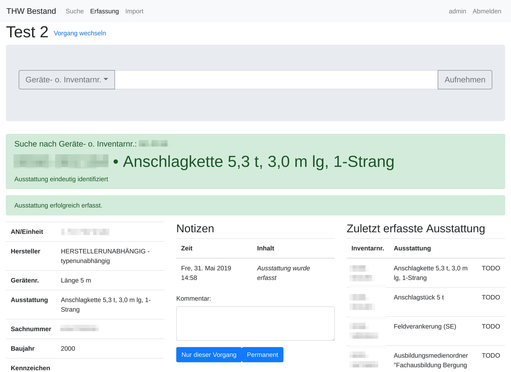

# THW Inventory

**Despite the name, the software is in no way affiliated with THW, except
being maybe of use for some enthusiasts being members of that agency.**

This is a web application to help with inventory assessments.
It provides a web interface to search for assets and tag assets which have been seen as part of an assessment.
Because this software is tailored to the requirements for the "German Federal Agency for Technical Relief"
([THW](https://www.thw.de/)), it is only provided in German right now.



## Icons

This project uses Free icons from Font Awesome, see license https://fontawesome.com/license/free

## Install

### Building

Build the JAR inside Docker using:
```
./build-jar.sh
```

### Start the JAR as a systemd service

- The JAR should *not* run a root user
- Running systemd services with user privileges is possible, e.g. user `bestand`
- Enable systemd user services without login:
```bash
loginctl enable-linger bestand
```
- Create a systemd service file at `~/.config/systemd/user/bestand.service`:
```
[Unit]
Description=THW Bestand

[Service]
ExecStart=/home/bestand/run-java.sh \
  -jar /home/bestand/thw-inventory-0.0.1-SNAPSHOT.jar \
  --spring.config.location=classpath:application.properties,file:///home/bestand/thw-inventory.properties
Restart=always

[Install]
WantedBy=default.target
```
- Create a `/home/bestand/thw-inventory.properties` file with the configuration properties of the app, e.g.:
```properties
server.address=127.0.0.1
spring.datasource.url=jdbc:mariadb://localhost:3306/bestand
spring.datasource.username=bestand
spring.datasource.password=somepassword
spring.datasource.driver-class-name=org.mariadb.jdbc.Driver
```
- Before running systemd commands as the user, you might need to fix the `XDG_RUNTIME_DIR` environment variable:
```bash
export XDG_RUNTIME_DIR=/run/user/`id -r -u`
```
- Enable and start the service
```bash
systemctl --user enable ~/.config/systemd/user/bestand.service
systemctl --user start bestand.service
```

### Setup nginx with SSL

- Install nginx and certbot with nginx plugin:
```bash
apt install nginx-light python3-certbot-nginx
```
- Setup new default host by replacing `/etc/nginx/sites-available/default`:
```
server {
        listen 80 default_server;
        listen [::]:80 default_server;

        root /var/www/html;

        server_name _;

        location / {
                proxy_set_header Host $host;
                proxy_set_header X-Forwarded-For $remote_addr;
                proxy_pass http://localhost:8080;
        }
}
```
- Obtain a SSL certificate with certbot:
```bash
certbot --nginx -d your-domain.example.com
```
